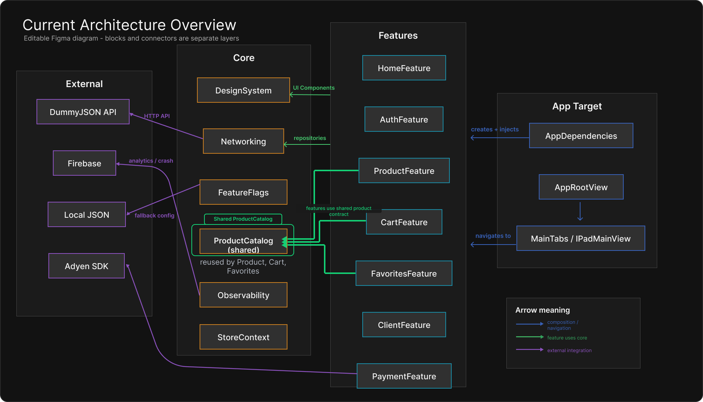
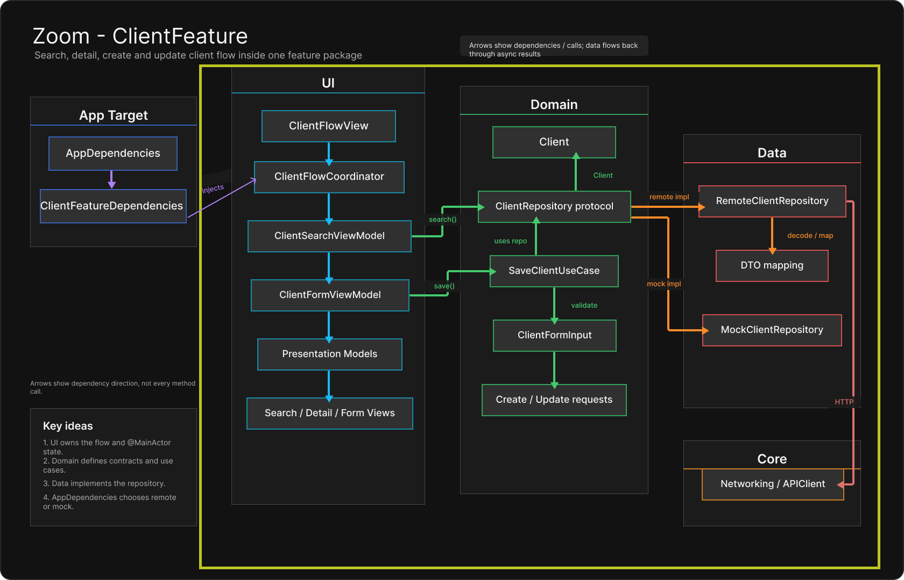
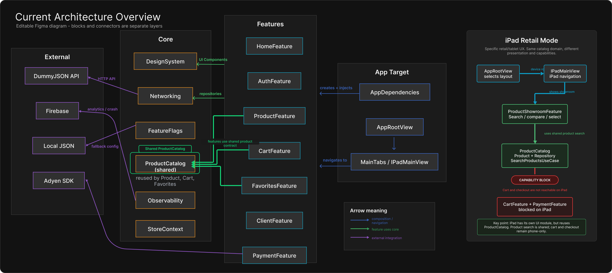

# ModularShopLab

ModularShopLab est un laboratoire d'architecture SwiftUI pour explorer une application retail modulaire.

Le projet cherche à montrer comment découper une application en features autonomes, comment partager des briques communes sans créer de dépendances circulaires, et comment composer l'application finale depuis un point unique.

## Architecture En Images

### Vue Globale



Cette vue montre le découpage principal entre les systèmes externes, le `Core`, les `Features` et l'`App Target`. Elle met aussi en avant `ProductCatalog` comme contrat produit partagé entre plusieurs features.

### Zoom Sur ClientFeature



Ce zoom montre la frontière du package `ClientFeature` : l'app crée `ClientFeatureDependencies`, puis la feature organise son flow autour des couches `UI`, `Domain`, `Data` et des dépendances `Core`.

### Mode Retail iPad



Cette vue illustre le cas iPad : l'app choisit une expérience dédiée avec `ProductShowroomFeature`, tout en réutilisant le domaine partagé `ProductCatalog`. Certaines capacités comme le panier et le checkout restent bloquées sur iPad via `AppCapabilities`.

## Philosophie

L'architecture suit une idée simple :

> L'app compose, les features déclarent leurs besoins, le Core partage les contrats stables, et les intégrations externes restent des détails d'implémentation.

Concrètement, une feature ne doit pas savoir si elle utilise une implémentation remote, mock, locale ou Firebase. Elle expose des entrées publiques, déclare les protocoles ou dépendances dont elle a besoin, puis l'app target choisit les implémentations concrètes.

Cette approche permet de garder :

- des features testables indépendamment ;
- un graphe de dépendances lisible ;
- des frontières explicites entre UI, domaine, data et infrastructure ;
- des expériences différentes selon la plateforme, par exemple `ProductFeature` sur iPhone et `ProductShowroomFeature` sur iPad.

## Séparation Des Couches

Le projet est organisé autour de trois grandes zones.

### App Target

`ModularShopLab` est le point de composition de l'application.

Il contient notamment :

- `AppDependencies`, qui crée les instances concrètes ;
- `AppCapabilities`, qui décrit les fonctionnalités disponibles selon la plateforme et les feature flags ;
- `AppRootView`, `MainTabs` et `IPadMainView`, qui assemblent l'expérience utilisateur.

L'app target peut importer les features, car c'est elle qui les assemble. En revanche, les features ne doivent pas importer l'app.

### Features

Chaque package dans `Features/` représente une capacité utilisateur :

- `ProductFeature` pour le parcours produit iPhone ;
- `ProductShowroomFeature` pour l'expérience showroom iPad ;
- `CartFeature`, `FavoritesFeature`, `ClientFeature`, `PaymentFeature`, etc.

Une feature peut contenir plusieurs couches internes :

- `UI` : vues SwiftUI, view models, coordinators ;
- `Domain` : modèles, protocoles, use cases, règles métier ;
- `Data` : implémentations concrètes, DTOs, mapping, persistance locale.

Les features doivent rester le plus autonomes possible. Quand plusieurs features ont besoin du même modèle ou contrat, on extrait ce partage dans `Core` plutôt que de faire importer une feature par une autre.

Exemple : `Product`, `ProductRepository` et `SearchProductsUseCase` vivent dans `Core/ProductCatalog`, car ils sont utilisés par plusieurs expériences produit.

### Core

`Core/` contient les briques partagées et stables :

- `DesignSystem` pour les composants et tokens UI communs ;
- `Networking` pour `APIClient` et les requêtes HTTP ;
- `FeatureFlags` pour les flags et `AppCapabilities` ;
- `ProductCatalog` pour le domaine produit partagé ;
- `StoreContext` pour le contexte magasin/employé ;
- `Observability` pour les logs et intégrations analytics/crash.

Le Core ne doit pas connaître les features. Il fournit des contrats ou des outils réutilisables.

## Injection De Dépendance

L'injection de dépendance est volontairement simple : elle se fait principalement par initialiseur.

`AppDependencies` joue le rôle de composition root :

```swift
@MainActor
@Observable
final class AppDependencies {
    private let apiClient: any APIClient
    private let productRepository: any ProductRepository
    private let favoriteStore: any FavoriteStore

    init(configuration: AppConfiguration = .current()) {
        let apiClient = URLSessionAPIClient()
        self.apiClient = apiClient

        switch configuration {
        case .remote:
            self.productRepository = RemoteProductRepository(apiClient: apiClient)
        case .mock:
            self.productRepository = MockProductRepository()
        }

        self.favoriteStore = InMemoryFavoriteStore()
    }

    func makeProductListViewModel() -> ProductListViewModel {
        ProductListViewModel(repository: productRepository)
    }
}
```

Les features ne créent pas leurs dépendances concrètes. Elles reçoivent uniquement ce dont elles ont besoin.

Pour les features plus riches, le projet utilise des objets de dépendances dédiés, comme `ClientFeatureDependencies` :

```swift
public struct ClientFeatureDependencies: Sendable {
    private let repository: any ClientRepository
    private let recentClientStore: any RecentClientStore

    @MainActor
    public func makeSearchViewModel() -> ClientSearchViewModel {
        ClientSearchViewModel(
            repository: repository,
            recentClientStore: recentClientStore
        )
    }
}
```

Cela permet à l'app de composer la feature depuis l'extérieur, tout en gardant les détails de construction internes à la feature.

## Règles À Retenir

- Une feature déclare ses besoins, l'app choisit les implémentations.
- Une feature ne doit pas importer une autre feature uniquement pour réutiliser un modèle.
- Les modèles et contrats partagés vont dans `Core`.
- Les view models qui possèdent de l'état UI sont `@MainActor`.
- Les implémentations techniques restent dans `Data` ou dans les modules `Core`.
- Les intégrations externes sont cachées derrière des protocoles ou services injectés.

## Documentation

Pour aller plus loin :

- [Current Architecture Overview](docs/architecture/current-architecture-overview.md)
- [Feature Modularization Audit](docs/architecture/feature-modularization-audit.md)
- [iPad / iPhone Retail Specifics](docs/architecture/ipad-iphone-retail-specifics.md)
- [SwiftData Client Cache](docs/architecture/swiftdata-client-cache.md)

## Skill De Migration

Le repo contient aussi un skill pour aider un agent IA à migrer un projet Swift ou SwiftUI depuis une architecture existante vers cette architecture cible.

- [Modular Architecture Migrator](skills/modular-architecture-migrator/SKILL.md)
- [Copilot instructions](.github/copilot-instructions.md)

Ce skill guide l'agent pour identifier les features, cartographier les dépendances, proposer un plan par phases, puis implémenter la migration progressivement avec validation à chaque étape.

### Installation Dans Codex

Le skill est versionné dans le repo, mais pour qu'il soit disponible globalement dans Codex, il faut le copier dans le dossier des skills Codex :

```sh
mkdir -p ~/.codex/skills
cp -R skills/modular-architecture-migrator ~/.codex/skills/
```

Une fois installé, il peut être appelé naturellement dans une conversation, par exemple :

```text
Utilise le skill modular-architecture-migrator pour analyser ce projet et proposer une migration vers l'architecture App/Core/Features.
```

Le skill chargera d'abord son workflow principal, puis ses références seulement si elles sont utiles :

- `references/target-architecture.md` pour les règles de l'architecture cible ;
- `references/copilot-integration.md` pour générer ou adapter des instructions Copilot.

### Utilisation Avec Copilot

Copilot ne charge pas automatiquement les skills Codex. Pour l'utiliser avec Copilot, le repo fournit déjà :

```text
.github/copilot-instructions.md
```

GitHub Copilot peut utiliser ce fichier comme instructions de repository. Pour un autre projet, il suffit de copier ce fichier dans le repo cible, puis d'adapter les noms de modules si besoin.

Pour une utilisation ponctuelle dans Copilot Chat, copier le prompt depuis :

```text
skills/modular-architecture-migrator/references/copilot-integration.md
```
