# Current Architecture Overview

Ce diagramme représente l'architecture actuelle de `ModularShopLab` après modularisation par feature.

## Vue Packages

```mermaid
flowchart TB
    App["ModularShopLab App Target<br/>Composition Root<br/>AppDependencies"]

    subgraph AppLayer["App"]
        Root["Root SwiftUI<br/>AppRootView<br/>MainTabs / IPadMainView"]
        Config["Runtime Config<br/>Mock / Remote<br/>iPhone / iPad"]
        Web["External Web<br/>WebTipsView"]
    end

    subgraph Features["Features"]
        Home["HomeFeature<br/>HomeView"]
        Auth["AuthFeature<br/>AuthView<br/>Login / Register / Forgot password"]
        Product["ProductFeature<br/>ProductList / ProductDetail<br/>ProductRepository"]
        Cart["CartFeature<br/>CartView<br/>CartStore"]
        Favorites["FavoritesFeature<br/>FavoritesView<br/>FavoriteStore"]
        Client["ClientFeature<br/>Client Flow<br/>Search / Detail / Create / Update"]
        Payment["PaymentFeature<br/>Tap to Pay<br/>UseCase + Worker"]
    end

    subgraph Core["Core"]
        Design["DesignSystem<br/>PrimaryButton<br/>LoadingView<br/>ErrorStateView<br/>ProductCardView"]
        Networking["Networking<br/>APIClient protocol<br/>URLSessionAPIClient"]
        Flags["FeatureFlags<br/>JSON / Remote<br/>Capabilities"]
        StoreContext["StoreContext<br/>Employee + Store context"]
        Observability["Observability<br/>Console + Firebase logging"]
        Foundation["ShopFoundation<br/>Light shared utilities"]
    end

    subgraph External["External Systems"]
        DummyJSON["DummyJSON API"]
        Firebase["Firebase<br/>Analytics / Crashlytics"]
        LocalJSON["Bundled JSON<br/>FeatureFlags"]
        Adyen["Adyen SDK boundary<br/>Tap to Pay adapter"]
    end

    App --> Root
    App --> Config
    App --> Auth
    App --> Home
    App --> Product
    App --> Cart
    App --> Favorites
    App --> Client
    App --> Payment
    App --> Flags
    App --> StoreContext
    App --> Observability
    App --> Networking

    Root --> Web

    Auth --> Design
    Auth --> Networking
    Product --> Design
    Product --> Networking
    Cart --> Design
    Cart --> Product
    Favorites --> Design
    Favorites --> Product
    Client --> Design
    Client --> Networking
    Home --> Design
    Payment --> Design
    Payment --> Networking
    Payment --> Observability

    Flags --> Networking
    StoreContext --> Networking
    Observability --> Firebase
    Networking --> DummyJSON
    Flags --> LocalJSON
    Payment --> Adyen

    classDef app fill:#1f6feb,color:#fff,stroke:#0d419d,stroke-width:2px;
    classDef feature fill:#dff6ff,color:#0f172a,stroke:#0891b2,stroke-width:1px;
    classDef core fill:#fef3c7,color:#0f172a,stroke:#d97706,stroke-width:1px;
    classDef external fill:#f3e8ff,color:#0f172a,stroke:#9333ea,stroke-width:1px;

    class App,Root,Config,Web app;
    class Home,Auth,Product,Cart,Favorites,Client,Payment feature;
    class Design,Networking,Flags,StoreContext,Observability,Foundation core;
    class DummyJSON,Firebase,LocalJSON,Adyen external;
```



## Flux Interne D'une Feature

```mermaid
flowchart LR
    View["SwiftUI View<br/>ex: ProductListView"]
    ViewModel["@MainActor ViewModel<br/>ex: ProductListViewModel"]
    UseCase["UseCase optionnel<br/>ex: SaveClientUseCase<br/>StartTapToPayUseCase"]
    DomainProtocol["Domain Protocol<br/>Repository / Store / Service"]
    DataImpl["Data Implementation<br/>RemoteRepository<br/>InMemoryStore<br/>Worker"]
    CoreDependency["Core Dependency<br/>APIClient / Logger"]
    ExternalSystem["External System<br/>API / SDK / Local memory"]

    View -->|"user action"| ViewModel
    ViewModel -->|"async/await"| UseCase
    ViewModel -->|"simple feature can call directly"| DomainProtocol
    UseCase --> DomainProtocol
    DomainProtocol -. "implemented by" .-> DataImpl
    DataImpl --> CoreDependency
    CoreDependency --> ExternalSystem

    DataImpl -->|"domain model"| ViewModel
    ViewModel -->|"observable state"| View

    classDef ui fill:#dff6ff,color:#0f172a,stroke:#0891b2,stroke-width:1px;
    classDef domain fill:#dcfce7,color:#0f172a,stroke:#16a34a,stroke-width:1px;
    classDef data fill:#fee2e2,color:#0f172a,stroke:#dc2626,stroke-width:1px;
    classDef core fill:#fef3c7,color:#0f172a,stroke:#d97706,stroke-width:1px;
    classDef external fill:#f3e8ff,color:#0f172a,stroke:#9333ea,stroke-width:1px;

    class View,ViewModel ui;
    class UseCase,DomainProtocol domain;
    class DataImpl data;
    class CoreDependency core;
    class ExternalSystem external;
```



## Règles D'Architecture

- L'app target est le **composition root** : elle crée `APIClient`, repositories, stores, use cases et services, puis les injecte.
- Les features exposent une API publique minimale : vues d'entrée, ViewModels nécessaires, modèles/protocoles utiles aux frontières.
- Les features gardent leurs dossiers internes `Domain`, `Data`, `UI` quand la feature grossit.
- Les ViewModels sont isolés `@MainActor`.
- Le réseau reste hors MainActor via `Networking`.
- Les états partagés en mémoire sont isolés derrière des stores ou services injectés.
- Les ressources localisées restent proches de leur module via `Bundle.module`.

## Lecture Rapide

```text
AppDependencies
  -> injecte les dependencies concrètes
  -> configure Mock ou Remote
  -> fournit les ViewModels aux features

Feature
  -> View SwiftUI
  -> ViewModel @MainActor
  -> UseCase si le workflow devient significatif
  -> Repository/Store/Service protocol côté Domain
  -> Remote/InMemory/Worker côté Data

Core
  -> DesignSystem pour UI commune
  -> Networking pour APIClient
  -> FeatureFlags pour capabilities
  -> StoreContext pour employee/store
  -> Observability pour logs console/Firebase
```
